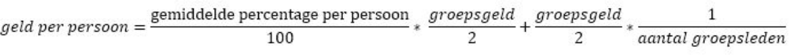

# soto_project

Programming project for Andrea Soto Padilla

## Anne

Hoi Richel,

Allereerst willen de mensen van mijn school liever een ander project gaan doen, dus die doen niet meer mee.
Ik heb nu verschillende vormen die modulair zijn (je moet één van de twee kiezen) in m'n hoofd:

Groepsverdeling:

1. We verdelen de groep in twee groepjes (één van drie en één van vier) die afzonderlijk van elkaar gaan proberen om het eerste probleem op te lossen. 
2. We verdelen de groep in drie groepjes (twee van twee en één van drie) die weer afzonderlijk het probleem proberen op te lossen.

Overleg:

1. Na twee of drie weken komen we bij elkaar en vertellen we wat we bedacht hebben. We overleggen dan hoe het handig is om verder te gaan en gaan daarna weer afzonderlijk verder. We komen dan elke week bij elkaar en doen het hele proces van overleggen weer opnieuw.
2. We gaan compleet afzonderlijk aan de slag en kijken gewoon wie het eerste klaar is.

Geldverdeling:

Als een groepje het eerder af heeft dan het andere groepje krijgt dat groepje een bonus van 10% (€25). De overige €225 wordt 50% 50% verdeeld over de groepjes. De groepsleden verdelen het geld onderling door anoniem percentages in te vullen bij iedereen inclusief zichzelf. Het gemiddelde van die percentages wordt gebruikt voor het verdelen van het geld door: 

Waarbij het groepsgeld (€225 / 2) + de eventuele bonus is. Hierdoor krijgt iedereen wat maar wordt je ook voor je inzet beloond.

Daarna:

Doen we project twee maar overleggen we eerst opnieuw hoe we dat zullen doen qua manier.

## Jorn