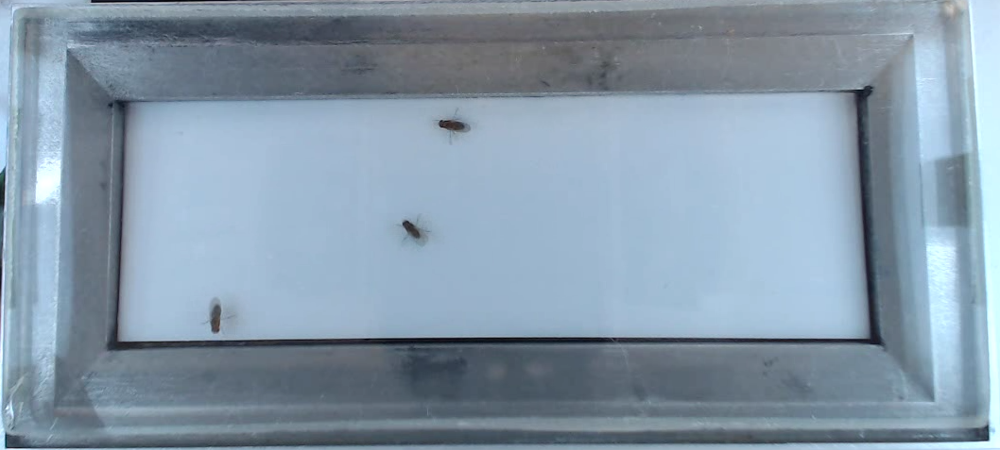

# soto_project

Programming project for Andrea Soto Padilla

 * [Tracker](Tracker/README.md)
 * [Geldverdeling](geldverdeling.md)

## Projectomschrijving

### 1. Fly ID

Team: ?Jorn, Joshua, Madelief, Same

Goal: Improve stability of fly ID through recording.
Number of flies: 1 to 6

Set-up: FlyTracker (Python) sets fly centroid through Lukas-Kanade method. Videos contain two red LEDs that are tracked and can indicate experimental phases. Fly centroids are changed from fly to fly when one or more subjects step outside of the tracking area or when two or more flies get close to each other (less then two fly bodies distance), especially at fast speed.

Request: 

	a. Maintain fly ID through video
	b. Identify if IDs were switched or lost
	c. Identifiy which ID, when, and for how long was lost
	d. Manual correction of switched IDs?

### 2. Calculation of distance between flies

Team: ?Anne, Katina, Quinten

Goal: Know the interactions of flies per experimental phase.
Number of flies: 1 to 6

Set-up: Use tracker output - based on (x,y) location per fly per frame - on Matlab or R to determine the distance between flies and use the ID to establish interactions between flies per experimental phase.

Requests:

	a. Being able to change the determinant of what an experimental phase is.
	b. Being able to adjust what a maximum distance to be part of a group is.
	c. Being able to adjust for how long a maximum distance must be maintained 	to be considered a group
	d. Produce mean, maximum, minimum, and median distance between flies 	per experimental phase.
	e. Indicate how many flies belong to a group per phase

Secondary requests (assuming we have good Fly ID):

	a. Indicate if a fly moves before the others (adjustable time) per phase
	b. Identify fly that move before others per phase and in which phase
	c. Do flies follow the 'leader'? (could be answered visually)
	d. Is there a non-conformist fly? (could be answered visually)

### Videos

You can find some example videos with 3 or 6 flies here: [https://goo.gl/NjxeZF](https://goo.gl/NjxeZF)

The set-up of the tracker (configuration_file.ini) is already established to limit the 
area of interest to the space where the flies are (white area) and to track the two red 
LEDs inside the Lego piece. 

## External links

 * Article: [Understanding Dynamics of Information Transmission in Drosophila melanogaster Using a Statistical Modeling Framework for Longitudinal Network Data (the RSiena Package)](https://www.ncbi.nlm.nih.gov/pmc/articles/PMC4835720/)
 * [OpenCV homepage](https://opencv.org/)
 * [Andrea Soto Padilla GitHub](https://github.com/asotopadilla)
 * [Andrea Soto Padilla University of Groningen page](http://www.rug.nl/staff/a.soto.padilla)
 * [Andrea Soto Padilla LinkedIn](https://www.linkedin.com/in/andreasotopadilla)
